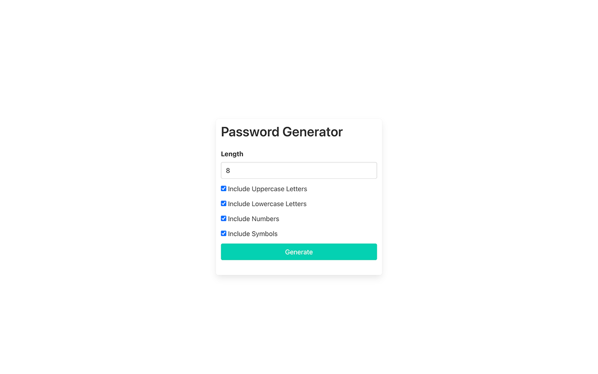
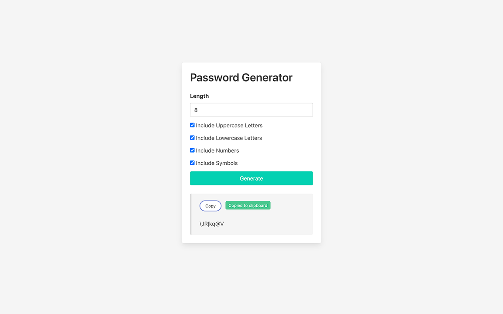
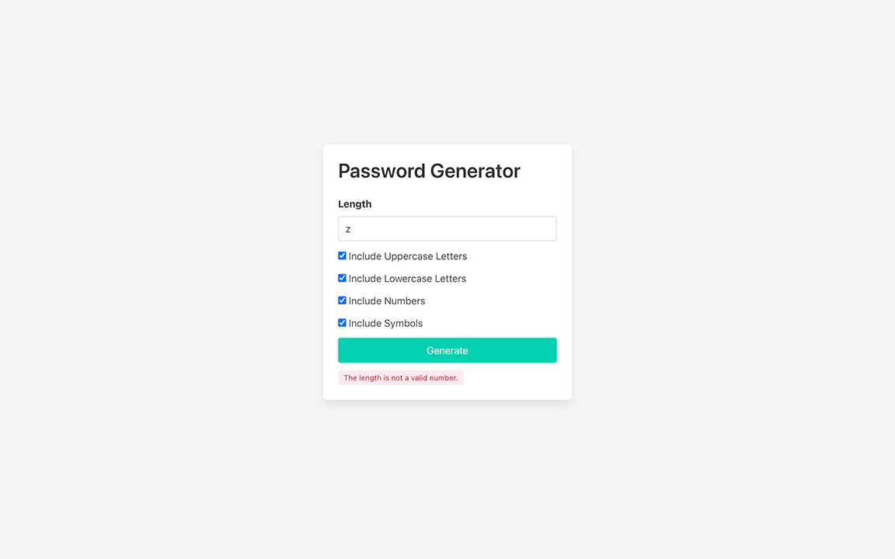

# Password Generator

A password generator with options, built with Angular 13.

## Table of Content

- [Live Demo](#live-demo)
- [Final Product](#final-product)
- [Dependencies](#dependencies)
- [Getting Started](#getting-started)
- [Credits](#credits)

## Live Demo

The web app is deployed to [Vercel](https://vercel.com/):  
https://the-pw.vercel.app/

## Final Product

  
Initial page

  
User can copy the generated password

  
Error message

## Dependencies

- [Angular 13](https://angular.io)
- [Bulma](https://bulma.io/)

## Getting Started

1. Clone or download this repository onto your local device.
2. `cd` to the folder where this project is cloned.
3. Install all dependencies with `npm install` command.
4. Run the app in the development mode with `npm start` command.
5. Open the broswer and visit: [http://localhost:4200/](http://localhost:4200/).

## Credits

- [Favicon](https://www.flaticon.com/premium-icon/key_807241) by [Freepik](https://www.flaticon.com/authors/freepik) on [Flaticon](https://www.flaticon.com/)
